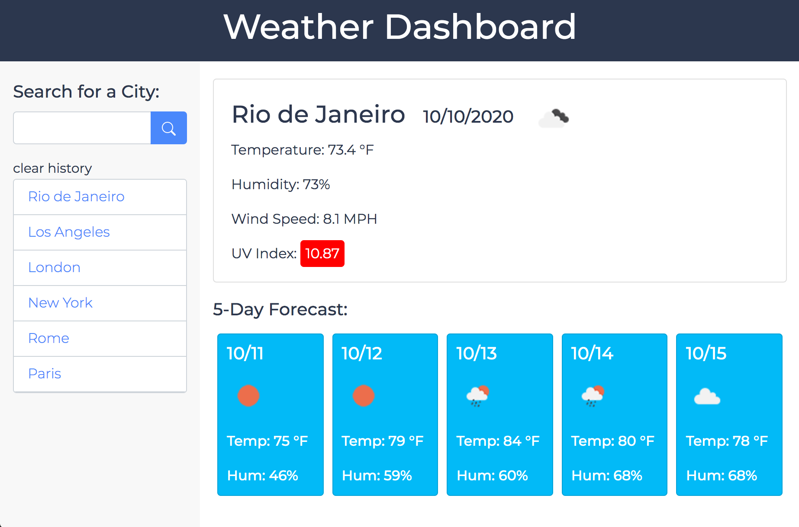

# Weather Dashboard 

    
[carolynmary.github.io/weather-dashboard](https://carolynmary.github.io/weather-dashboard/)

- - -
- - -
#### A weather dashboard to get current weather with a 5–day forecast in multiple cities so you can plan your travels accordingly. Includes temperature, humidity, wind speed and uv index.
- - -
- - -

[How to Use](#how-to-use) // [Credits](#credits) // [Questions & Feedback](#questions-feedback) // [License](#license)

## How to Use 

Input any city (national or internation) in the search field to get information. We store your search history for easy access to your past searches.

## Credits

[Open Weather](http://api.openweathermap.org) // weather API  
[Shutterstock](https://www.shutterstock.com/developers/) // Image API  
[Unsplash](https://unsplash.com/developers) // Image API

## Questions & Feedback

Have a question or feedback? Send me a note or just say hi. I'd be happy to hear from you!

> "Knowledge is having the right answer. Intelligence is asking the right question.” <small>~ Unknown </small>

<a href="mailto:carolyn@carolynmary.com">carolyn@carolynmary.com</a> // <a href="https://github.com/carolynmary"> github.com/carolynmary</a>

## License

The code is licensed under the [MIT License](https://choosealicense.com/licenses/mit/).
 
 
 

© 2020 Carolyn Mary Stolze